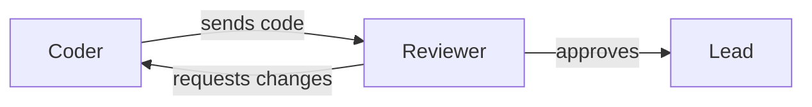
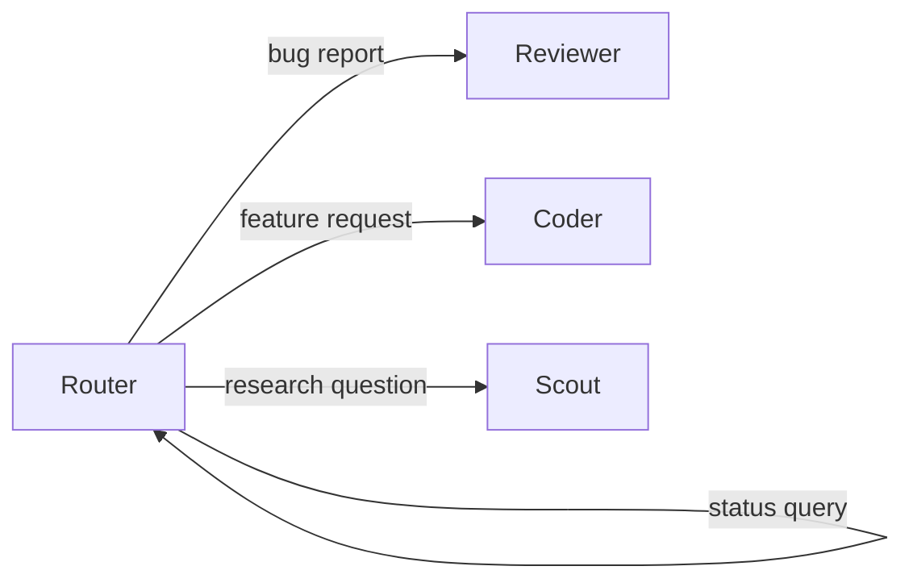
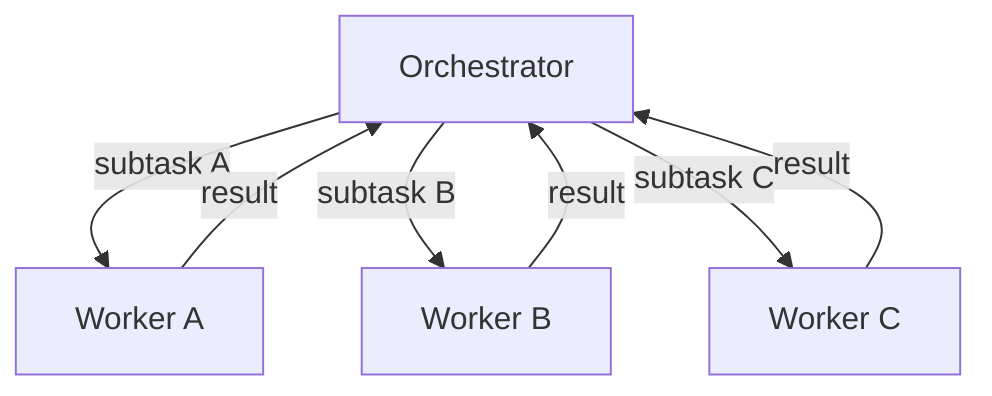
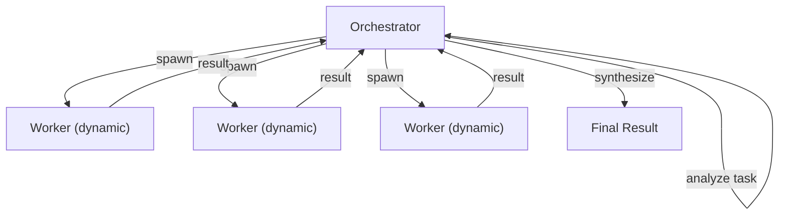
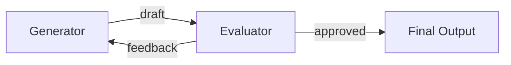
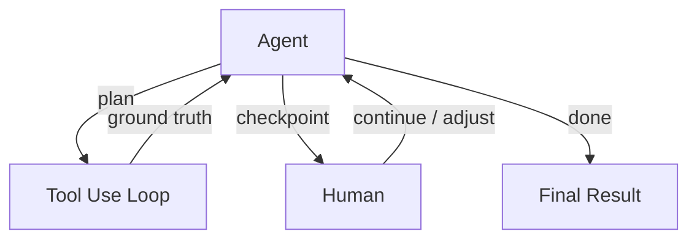

# Agent Authoring

Knowledge for writing .soul files, designing multi-agent workflows, and spawning well-crafted agents in the Mozart orchestrator.

## .soul File Format Reference

Every agent is defined in a file named `<agent-name>.soul`. The filename (minus the .soul extension) becomes the agent's ID automatically.

### Required Instructions

**MODEL <provider/model-name>**
The LLM model to use. Must be a valid OpenRouter model ID.
Examples: openai/gpt-4.1-mini, openai/gpt-4.1, google/gemini-2.5-flash, google/gemini-2.5-pro, anthropic/claude-haiku-4.5, anthropic/claude-sonnet-4, anthropic/claude-opus-4.5

**IDENTITY <text>**
The agent's persona and instructions. For multi-line content, use heredoc syntax:
  IDENTITY <<BLOCK
  Your multi-line persona goes here.
  BLOCK

### Optional Instructions

**IF "<condition>" THEN "<action>"**
Conditional rule. When the natural-language condition matches, the agent carries out the specified action. The action is free-form — it can route to another agent, call tools, respond in a specific way, or anything else. You can define multiple IF/THEN rules. Examples:
  IF "the user reports a UI bug" THEN "route it to frontend-agent with full context"
  IF "the user asks about pricing" THEN "recall pricing info from memory and respond with a summary"

**SCHEDULE "<timing>" "<task>"**
A recurring scheduled task defined with natural-language timing. The timing is automatically converted to a cron expression. Examples:
  SCHEDULE "every 5 minutes" "check the system health"
  SCHEDULE "weekdays at 9am" "send a morning briefing"
  SCHEDULE "every hour" "summarize recent activity"

Schedules are managed exclusively through the .soul file. Agents can add, remove, or modify schedules at runtime using `read_soul` and `edit_soul` — changes take effect immediately.

**SKILL <reference>**
Install and activate a skill. The skill's content (instructions, workflows, examples) is injected into the agent's system prompt. Skills are fetched from GitHub via skills.sh using `owner/repo@skill-name` format.

Examples:
  SKILL seanli/mozart-skills@agent-authoring
  SKILL anthropics/skills@skill-creator
  SKILL vercel-labs/agent-skills@vercel-react-best-practices

Browse registry skills at https://skills.sh/

**MAX_ITERATIONS <number>**
Optional. Maximum number of tool-calling loop iterations per message (default: 25). For advanced users.

**MAX_HISTORY <number>**
Optional. Maximum number of conversation messages to include as context (default: 100). For advanced users.

**MEMORY <size>**
Optional. Container memory limit (default: 256m). Examples: 512m, 1g. For advanced users.

**CPUS <count>**
Optional. Container CPU limit (default: 0.5). Examples: 1, 2. For advanced users.

### Syntax Rules
- Lines starting with # are comments
- Blank lines are ignored
- One instruction per line
- The file must end in .soul

## Building Blocks — The Augmented LLM

Every agent in Mozart is an augmented LLM — an LLM enhanced with retrieval, tools, and memory. This is the foundational building block before composing any multi-agent pattern.

Each agent automatically has access to:
- **Retrieval**: `search_memory`, `web_fetch`, `read_file` — pull in context from memory, the web, or the filesystem
- **Actions**: `shell`, `write_file`, `send`, `spawn_agent` — act on the environment, communicate with other agents, create sub-agents
- **Memory**: `save_to_memory`, `search_memory` — persist and recall information across conversations
- **Skills**: Any SKILL instructions inject additional capabilities and domain knowledge into the agent's prompt
- **Self-modification**: `read_soul`, `edit_soul`, `update_skill` — inspect and modify the agent's own configuration and skills at runtime. Changes to identity, model, conditionals, and schedules take effect immediately

Tailor these capabilities to the agent's specific role. Write clear IDENTITY text that explains *how* and *when* the agent should use each tool — good IDENTITY text is like a great docstring for a junior developer. A single well-augmented agent with the right tools often outperforms a multi-agent system.

## Multi-Agent Workflow Patterns

These patterns are composable building blocks for multi-agent systems, ordered from simplest to most complex. Start with the simplest pattern that solves the problem — only add complexity when it demonstrably improves outcomes.

**Important: IF/THEN actions can invoke any tool.** The THEN clause is a natural-language instruction, not a function call. The agent interprets it and uses whatever tools are needed — routing, spawning, memory, web fetching, etc. A single THEN can chain multiple actions. Examples:
  IF "task is complete" THEN "send the result to reviewer"
  IF "research spans multiple topics" THEN "spawn temporary agents for each topic, then synthesize results"
  IF "user asks about past decisions" THEN "recall relevant context from memory and respond with a summary"

### 1. Prompt Chaining

Decompose a task into a sequence of steps where each agent processes the output of the previous one. Add gates (validation checks) between steps — the receiving agent can validate or reject input before proceeding.

**When to use**: The task can be cleanly decomposed into fixed subtasks. Trade latency for higher accuracy by making each step easier.

**How to build it**: Use IF/THEN rules to forward output from one agent to the next. The receiving agent acts as a gate.



Example — a code pipeline:
  coder: IF "implementation is complete" THEN "send the code to reviewer for review"
  reviewer: IF "code passes review" THEN "approve and send the result to lead"
  reviewer: IF "code needs changes" THEN "send specific feedback back to coder"

### 2. Routing

Classify an input and direct it to a specialized agent. Each downstream agent has a focused prompt optimized for its category, avoiding the tradeoff of one agent trying to handle everything.

**When to use**: Complex tasks with distinct categories that are better handled separately, where classification can be handled accurately.

**How to build it**: Create a router agent with multiple IF/THEN rules that dispatch to the right specialist. List the routing criteria in the IDENTITY text.



Example — a team lead routing work:
  IF "the user reports a bug" THEN "route to reviewer with full context"
  IF "the user asks for a feature" THEN "route to coder with clear requirements"
  IF "the user asks a research question" THEN "route to scout"
  IF "the user asks about project status" THEN "recall from memory and respond directly"

### 3. Parallelization

Run multiple agents simultaneously and aggregate their outputs. Two subtypes:



**Sectioning** — break a task into independent subtasks run in parallel:
- Spawn temporary agents, each handling one subtask. The spawning agent synthesizes the results.
- Example: scout spawns temporary agents to research different topics simultaneously, then combines findings into a single summary.

**Voting** — run the same task multiple times for higher confidence:
- Spawn multiple temporary agents with the same task but different instructions or models. Compare and aggregate their outputs.
- Example: spawn 3 agents to independently review code for vulnerabilities, flag issues only when 2+ agents agree.

**When to use**: Subtasks can be parallelized for speed, or multiple perspectives are needed for higher confidence results.

### 4. Orchestrator-Workers

A central agent dynamically breaks down tasks, delegates to worker agents, and synthesizes their results. Unlike parallelization, the subtasks are NOT pre-defined — the orchestrator decides at runtime what workers to create based on the specific input.

**When to use**: Complex tasks where you can't predict the subtasks needed ahead of time (e.g. the number and nature of files to change depends on the task).

**How to build it**: Create an orchestrator agent whose IDENTITY instructs it to analyze the task, decompose it into subtasks, and spawn focused workers for each. Each worker gets a narrow scope and a lightweight model.



### 5. Evaluator-Optimizer

One agent generates a response while another evaluates it and provides feedback in a loop. The generator iterates until the evaluator approves.

**When to use**: Clear evaluation criteria exist, and responses demonstrably improve when given articulated feedback — analogous to a human writer iterating on drafts.

**How to build it**: Two agents with IF/THEN rules forming a feedback loop. The evaluator either approves (forwards the result onward) or rejects (sends feedback back to the generator).



Example — a coder/reviewer cycle:
  coder: IF "reviewer sends back feedback" THEN "address every point and re-submit to reviewer"
  reviewer: IF "code passes review" THEN "approve and notify lead"
  reviewer: IF "code needs changes" THEN "send specific feedback back to coder"

### 6. Autonomous Agents

An agent that plans and operates independently in a tool-use loop, returning to the human at checkpoints or when it hits blockers. It gains ground truth from tool results at each step to assess its own progress.

**When to use**: Open-ended problems where the number of steps is unpredictable and you can't hardcode a fixed path. Requires trust in the agent's decision-making.

**How to build it**: Give the agent clear IDENTITY instructions for planning and self-assessment, and appropriate MAX_ITERATIONS. Use SCHEDULE for periodic check-ins. Include explicit stopping conditions in the IDENTITY text.



**Caution**: Autonomous agents have higher costs and potential for compounding errors. Set appropriate guardrails — MAX_ITERATIONS to cap runaway loops and clear IDENTITY instructions about when to stop and ask for help.

## Best Practices

Three core design principles (from Anthropic's "Building Effective Agents"):

1. **Simplicity first** — Start with the simplest solution possible. A single well-prompted agent with good tools often outperforms a multi-agent system. Only increase complexity when it demonstrably improves outcomes. For many tasks, optimizing a single agent with retrieval, memory, and in-context examples is enough.

2. **Transparency** — Write IDENTITY text that instructs agents to show their work: explain reasoning, announce routing decisions, and summarize results. The user should always understand what the agent is doing and why.

3. **Agent-Computer Interface (ACI)** — Invest as much effort in tool documentation as in prompts. Write IDENTITY text that clearly describes when, why, and how the agent should use each tool. Include examples and edge cases. A well-documented tool interface prevents more errors than clever prompting.

**When describing multi-agent workflows to users, always include a mermaid diagram** showing the agent communication flow. The chat UI renders mermaid natively — just use a ```mermaid code block.

Additional guidelines:
- One clear role per agent — keep IDENTITY focused
- Use descriptive filenames (e.g. code-reviewer.soul, data-analyst.soul)
- Use heredoc (<<BLOCK ... BLOCK) for multi-line IDENTITY blocks
- Chain agents with IF/THEN rules to build workflows and pipelines
- Always search for and include relevant SKILL instructions — don't create agents without checking skills.sh first
- ALWAYS include these two base skills in every agent you create:
    SKILL seanli/mozart-skills@agent-authoring
    SKILL anthropics/skills@skill-creator
  These give every agent the knowledge to author agents and design workflows, and create new skills. Add domain-specific skills on top.
- For agents that need to retrieve content from uploaded documents (PDFs, reports, knowledge bases), add the Ragie RAG skill:
    SKILL seanli/mozart-skills@ragie-rag
  Requires RAGIE_API_KEY to be set in the host environment.
- Pick lightweight models for simple tasks: openai/gpt-4.1-mini, google/gemini-2.5-flash, anthropic/claude-haiku-4.5
- Pick stronger models for complex reasoning: openai/gpt-4.1, google/gemini-2.5-pro, anthropic/claude-sonnet-4, anthropic/claude-opus-4.5
